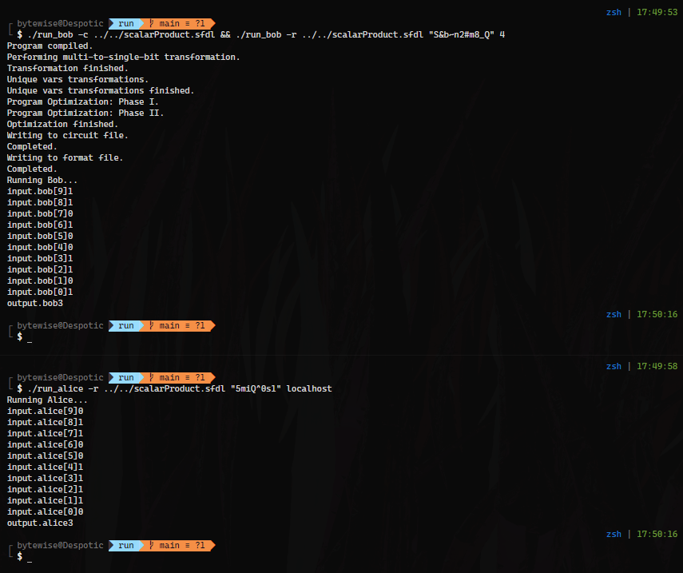

# Part 1 - Fairplay

## Implementation

Both users are set to input a vector of length 10, where each element is of a type `Int<8>`.
Either user is only allowed to input a `0` or `1`.

The output of each user is of a type `Int<8>` and does not have to be a `0` or `1`.

The main function simply iterates over both vectors running a bitwise `&` on both input arrays then adding the result to the local variable `Int<8> accum`.

The final value of `accum` is given as the output for both users.

## Setup

| Count | Alice |  Bob  | Expected |
| ----: | :---: | :---: | -------: |
|     9 |   0   |   1   |        0 |
|     8 |   1   |   1   |        1 |
|     7 |   1   |   0   |        0 |
|     6 |   0   |   1   |        0 |
|     5 |   0   |   0   |        0 |
|     4 |   1   |   0   |        0 |
|     3 |   1   |   1   |        1 |
|     2 |   1   |   1   |        1 |
|     1 |   1   |   0   |        0 |
|     0 |   0   |   1   |        0 |

Final Expected Value: 3

### Commands Used

#### Bob Terminal

```sh
./run_bob -c ../../scalarProduct.sfdl && ./run_bob -r ../../scalarProduct.sfdl "S&b~n2#m8_Q" 4
```

#### Alice Terminal

```sh
./run_alice -r ../../scalarProduct.sfdl "5miQ^0s1" localhost
```

## Output



## Findings

The scalar product of both vectors has worked as expected.
