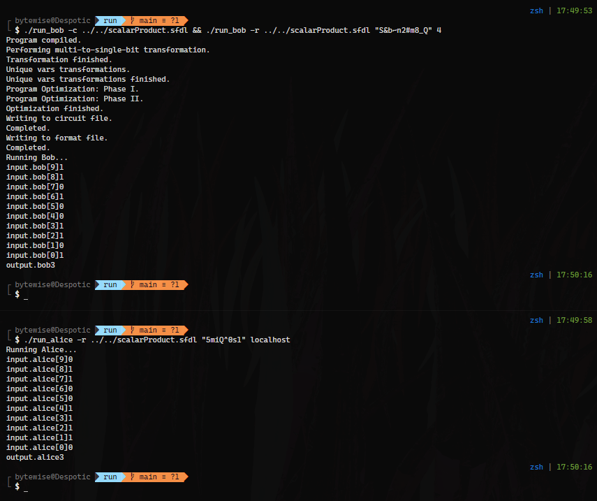

---
geometry:
-               margin=0.5in
-               letterpaper
classoption:    table
documentclass:  extarticle
urlcolor:       blue
fontsize:       11pt
header-includes: |
    \usepackage{multicol}
    \usepackage{graphicx}
...

\normalsize
\pagenumbering{gobble}
\newgeometry{margin=5cm}

\title{%
  HW3 \\
  CS528 Fall, 2021}
\author{Isaias Rivera}
\date{Nov 28, 2020}

\maketitle

\newgeometry{margin=1in}
\normalsize

\pagenumbering{arabic}
\setcounter{page}{1}

# Part 1 - Fairplay

## Implementation

Both users are set to input a vector of length 10, where each element is of a type `Int<8>`.
Either user is only allowed to input a `0` or `1`.

The output of each user is of a type `Int<8>` and does not have to be a `0` or `1`.

The main function simply iterates over both vectors running a bitwise `&` on both input arrays then adding the result to the local variable `Int<8> accum`.

The final value of `accum` is given as the output for both users.

## Setup

| Count | Alice |  Bob  | Expected |
| ----: | :---: | :---: | -------: |
|     9 |   0   |   1   |        0 |
|     8 |   1   |   1   |        1 |
|     7 |   1   |   0   |        0 |
|     6 |   0   |   1   |        0 |
|     5 |   0   |   0   |        0 |
|     4 |   1   |   0   |        0 |
|     3 |   1   |   1   |        1 |
|     2 |   1   |   1   |        1 |
|     1 |   1   |   0   |        0 |
|     0 |   0   |   1   |        0 |

Final Expected Value: 3

### Commands Used

#### Bob Terminal

```sh
./run_bob -c ../../scalarProduct.sfdl && ./run_bob -r ../../scalarProduct.sfdl "S&b~n2#m8_Q" 4
```

#### Alice Terminal

```sh
./run_alice -r ../../scalarProduct.sfdl "5miQ^0s1" localhost
```

## Output



## Findings

The scalar product of both vectors has worked as expected.

\newpage

# Part 2 - HE

## Design and Implementation

The design of this cryptographic protocol is fairly simple.

The sender simply sends their public key to the receiver alongside their matrix where every element is encrypted.

The receiver can then run calculations on this matrix, encoding their own values to be used in calculations where applicable.

Finally the receiver sends back the final calculation to the sender.

## 512 bit key

### Input

#### Alice

```py
[[108   6  35  83 109  52  23  59]
 [  5  47 111  64  32 127  70  75]
 [ 21  63 110  39  73   1  21  24]
 [ 95  29  51  80  70  64   2   9]
 [123 127  68  98  73  92  70 104]]
```

#### Bob

```py
[[105 126  60 123]
 [ 82  63  19  24]
 [ 19  79  98  46]
 [ 75 121  91 115]
 [ 49  23  68  33]
 [ 16  11   5  85]
 [ 83  33  26  70]
 [ 98  20  13   4]]
```

### Output

#### Decrypted Result

```py
[[32586, 31812, 26614, 34446],
 [28048, 26047, 23501, 31260],
 [20074, 22887, 22613, 17700],
 [24824, 30066, 23778, 31853],
 [53022, 47810, 33971, 48120]]
```

\newpage

#### Last Ciphertext

\tiny

```py
[[7569420083534309627912391436277885549318437507884768651601723056385143712743027002097158532706296532861643535088722533899178176652626034179100819166826834
269940279366685131495777799074675442377685972687962895306175422831798030858972230732547451077499621471853534369824020476301939407853885249835743783468950,
1617146420359752273134618913667365262295118241907567878227396321641825804637742720501966745069361518959368543386297540061933990852642765773143576980774674
8935921391219760818182827582801070218989104246486052642930107285478264053305212794295730866209274841940948894531858917205469778185981446354943024463977051,
4255682741113062596485331982575864511746831738678389859543250322584918669584417714563238521540079593509489555749355896201345691997842414011799935406266357
1448289410291519312148729224921328138099825762340414594289225579812411930654481981256129594484564227975699589042859947694842652265989683291390252845839866,
2926994599594159248997620864092363125059859806943614055547865133916357610057976480179456047284970181812121329203292305128448315622902996776597487251801764
6725900262525183713755971044757410600494253155106644605946236048880360330477007457857202853181910873735609629464309320257175307125692493110322930516524102,
6201626191779974565418970480314997974474705082015038802974340798583581888901413744723188694487682523245221984221367576183067626307579165978933500328231771
534840612688098037584222037697457096580991616258383545169964945453777451264891383727628819252926715567207918860387089488931723194186077349620975685577119,
1518233881338885043160615852352242776631529785985792356810181473057399212646642253143957378855769828722957185039180172523186500266456124074375443479637624
5155138134575438601840730439428130414689798190590160157953427222349868803048792714192638408824024102759640294213730168143118020923559148462771790052120393,
4880992375575535507488959318999756534014049540016786854299462244307847840350024522519859736908866476156203822070516557097687091294095773907712735249992847
7293340796085659464963385446000546288524923717274636438657019739777612501388291836380072668311730163560899746729459419051389719745550802050814818337745808,
6866925051895945125513090118174344904900772229598933075516523384669398735600222040768852057597864447799679349010234993490159788987636102310925907517541287
514438550229068686764267799537528983870230123583255143131472996787730671566979520265506083598080882342832636587631410767726785100963933285028176545574008],
[25776309469495466549092022980060494820768766891122119211319507459791271072630865591048955956324335909232467616780515477699822734894500349387980048663165237
606646263458350549778453606306347038022382869658134465460491970466790991587202973113077793169308812768858025134806418614448040584505160914962728002549162,
1295355211426899330032186333563926340720370306780584919400316689959369097346453104340024851229325182537205137569601184221927473388427208439543380279530172
5726491146553093239725503794785947574280563229692877900082073294711198114675466659105481319842603569367390242920141019552784626818261253582031072908836074,
6009781359137604919095276881195043838342361777684168017327974470836841032902028634240002580324246067794586820073685651882355367461164817181804177186068138
521129516036454451608117098075597006497626438093721786915148881732685709230025353310762127442240408561219705242039104295913431137356494831591224635481896,
3050150917638294416158061486807959979205127292733812009057489488424815083912792245065939618525192732191492956516491114608908149249559634224006153978081843
6575261914288773618817654266198854666194047584272316619015841299089470061708994528748747938047443213627388879323940438737201613808681576624530915500064914,
3645658821646536676339031779090283050502744041439410455239374901449319703310050038831706927625991609553868758903293878474228678271176862480042313074286690
1728316183912063905040927942931995330983191080208193389532108005042629489179016312378112544546143223524686334508727949321884757221660840996920494574008673,
1947193123482932456738509851543686947018804239857217303919756721861599713729167406272511631068890117837128311627130879670313385369146720802522540909862853
6196543133879917764599801884212130611177924182252616231985997311486705302515111766141579729936228582408626355514491867430615716010492241842311346398736545,
3645772691806511832996776136581424145201495897445908641977097577881098258750865102676458659462871851476165452203491916414213687359935341939200328554239659
8556303888250598079712369900488884025870880729418312514847096533470743829672982154559030331554847161120497862066575081000109571411053947999843916087710198,
1734607989755873233878641456001764481501895095652910961829666601996262063783512855055294105481343870394879221352293570672319169815614118425468808765212616
5007363343454276323055836440496592307576535370822863619132699211807593996879675049821468065651658652925427035874403006681507645398635060840834459649682934],
[11049327974236064375813874468890415028579336433897517814673888449014083499812898315704721869945421075360519713216612314104322501517528654691593881087389679
899589900963657966103703654148684852573282072010767898343241206971802696092240857088476689117496501579771512506090296532470231249790590925495082132439870,
4535101868111570358040443951410738809587580484046558913572929172809814757750759682886194684177828230076811646757029479510929338307483838953040379209236707
7074856826421868834395553233891575120147350430895296761933206265980205019163114988075982613635090997852021359617159881279829869169747379000098020238135626,
1821217695078064868634190929316373697067576702687140396913069396340620867283904504796571897259816816772378362703377505156323631141299848076656925357097894
5507332964801164198619738413041498763889543803871287071949880015709887009170459035557195826522114459218659618497677010950457225655793448432825740924658689,
1162809679871756556763047591049805718127540132968864561520468311662985185160285073190995957398787417926517706279504496930680141607084171834448151692773886
5634008202462500738324316058908314794136323180441717103447341741002283319207746957052115491348237847551509309936893312308606161098231104201775427813054768,
1043647346288886737919350733533547616235870443492667148625723508510734476876409631598668586406542472441019679932438866369552015268346238558666038933082995
2497249496033082852306266111502303320823762254999200097042503398664323971426720616825621360205149785732071672417081790187306825917620079694579616507947400,
2721487520310488681905530040187150942410676042486531027417984030323082982328262976015583239862577640414621241332293323322172795242497771778365820133178252
0​292423580819555879927882875337359930078282665301099706150318845454242321905730605547999735629269070882866752381866641913691458713463595227581089956343858,
5113072379531131961165537935448009278473486467506161807902257366323374565485319519669457662263070353394205304562352279269564648639818879373124851045744847
3524052955354212020590536789064341878589832892716513721877829332566658724302333538113197450366018159464991396119493855847823244738375340293825521472152812,
1655525655240756542484764980693608968428007137619692636447383509954898341814088213942718253709332588549825873177954465199546673685697852120614216976235282
7383314849334285774595486249425486000793300752721931224680451902831993944681989180101781944731147894431666475284411008295176408760687324208263764496576071],
[18176324625127676718963940270536930857659662502193945535022897799064283646837390523923008884313500640902860126107281590492345939310425109701960304730992277
177224995403486526026140486265820277082905096895515728362364835580218643236398275382526709411962294413123430690735007525593792546004843499873371021245188,
3755167893661373296299636749026272066930374966221450954339066828446052017188402302777266129440296816689321587707268579306621873677458311673495716469126841
9738175165549969511294350435577387179764710678543139837832521198410523999192678191144527782403452495723130016213495133948012208633103002001682522126213226,
5574776361462041451594932081250596867330073679879088867793260450863227107269977536898205689017884660081842198596749344587666674426137938620346390782365407
9533298944425755314483097940827486233250629212996433293940426321923913086579989143542138817322951702513975223254381544980242823778425944488307313464775804,
4787468397635947009078193289830222922529012611792265456221813083060950880495473992032496981687406547407254370163788118948100612058899542531389386575224086
6039706657094839942863956572003659172031725405017808470526412057340246520545257301005243142579592667572221605382257546231066929400201648309143166600220958,
2772749095279363078969154027508834441716272456039627949084810600538225447737843312703162685664121752729572475510607552601419131210467884341929955885385821
5809211250161795564651335090320524075087210747246846654479597286956007299472774224320658336742800908889095405257989514090017648004469997321054814377945111,
8606671664878253608253972117375061508616141653507320337861226517322075699410180212607945911094689606312710940549050129411250922907410659569319792046676163
293031782434800236687220196680529889333825185382343363698623861562574953580099643844129047345691431230341752493179458044793320477950184305935812266261477,
5103944363053778354435990661625784557542728686508600545655537627439925440426315520116537698622605820007002471319901013358919140941599703003079509040108223
3695569263105552270638583448305301403634518287925627282838838069479230933912765661883160725997482569809458765054023441308070604344535183159478658550832230,
4394912559998348790184950923242622736326041419699511740009803104977146806811985144558351756740438561801039711835272049446413568986420079407497634132403945
5122976026326551558163137542104038877898540973588588961566426586865607410356694876200390805238648835772970067906151596359731576213095924518596916071486709],
[11629780905017513307821528932942514395496465880272270868502280709785955695309903742868506129415358191066411506956913578624497818478300497463646212705395041
117997589061278973857403048939011404962039968705900967764616533100679994383361318190628320591072460477950810610791961769335912708774112885152968067796298,
5306012133213021672297807158910468305937926809686235902356045432336434106285645274377083829381340809606227968645117382488809014282712615053183418460497864
0​664180670721009243766230166699040255901956240934100969132191895031317261660892645730317570105980412327299311425211234898765120109570997378028686731952255,
5867923246196613069811317258258236379126450562032607826328548848612103622565314323256749494055785168154146489699522072647751761905012393329109668052945968
35760770385159685424860348703396368512579079154230073060358178940440701291662155545121276773098245798489610596569794701651513328468913418039057462067030,
3656379974932583310532174458351138630866961992838316350034967685086181155378667093299596709447213958061491223576202680605760811337605774403803300662364750
5547350853734021058777561459346055242458694500087217197280312194634977766027166567005087187334897415285196726574093980568758453705806094371563676381274555,
3868541703967562894278696198356383362674874633316927860828866451529076321077830537844374489199782888419565284187465239531946860708047833949364787937906493
2982359490255674307996381493595860318267389419509358872675759261417723039026688132292763751475458759004050068823869702511356260724564224061104621345266839,
2304858743920732596458972847283691422867428717211588615218190761902985423871843223976234836809756785231964538362870355955504428216357227729555098561901242
5294244325060415091020402282114409585235621868258642025042981231307476142774447813071331109900564505564391634788302131599370507347810206034832969674986442,
1626606415046247848376002576125961371540580922756989670205612980136127037594653263213130459757118680379504389989791806991912564398546713250398923573095296
6707852875138453114721230657045370301330484867128412395011424868365901679577666746118543083440009555254522036467328665213387495872321619216386652386297253,
4809486279646495430055905931660428028692303161105675137833476734055825435614034818935686300034607707292790239333544772514135395099480029339827070363342303
7216671906142634608703348660186920127614190233897359424955118685201176233385762094228893320779213023482799331910504606354295836928096043729524917552086727]]
```

\newpage
\normalsize

## 1024 bit key

### Input

#### Alice

```py
[[116  19  95  94  38  15  48 116]
 [ 14  93  11  73 112  25 108  87]
 [ 17  84  42  53  53 113  72 109]
 [109  12  16  86 117  47  22  21]
 [ 75  49  63  22  14  52  53 100]]
```

#### Bob

```py
[[ 86 100 104  82]
 [ 27  99  20  89]
 [119 110  37 123]
 [ 78  78   1  58]
 [ 79   4  74  61]
 [ 88  68  46  17]
 [102  80  85  47]
 [ 12  14 122  42]]
```

### Output

#### Decrypted Result

```py
[[39736, 37899, 37787, 38041],
 [33826, 29517, 33028, 30999],
 [35645, 33952, 33593, 30226],
 [34185, 26274, 27506, 26814],
 [29274, 30229, 31266, 27965]]
```

\newpage

#### Last Ciphertext

\tiny

```py
[[85521830923377775232893532582787130011211440067382214609321714271656233547924711513202265969390006367744728112318964341170382133361608243044323163600134
139240598472392176996569756499050954109628833533859787984259671271818455736668552154442480935992146574234573740864344454445082875503283005473171862022898528
0​650864794114411269877978293721293299640481106420158002715224331229800135266934593897002808913718734816835155718502789232686016268864929118833008776653077
2122000589773440569033766950114517892560229493054389008175613614132198636225341760281574267212659799568734764961651517365993744018931934859584701638253879,
2940204579935941409502081304350925328376973962402358486040745848284617561453483687849603981693603075946554906711787207488089748715102498481759219010421034
0​826943343391405442519505338194979890847798221494365753953510117798692292840254777374717573308407812984751864037339809626785559109241347820628917163747157
1803606941780737890862924375805210037403436747413126194832900947098892965491839700290127255796502836683652310914229659281040533177640280064741984455859182
1327783272829386921970593438277990604442395417231691353312800004011828547144838578816837805127702149806442404589831385341821755344923147303185870399638121,
7382720739427907405748719031699332647891342341549337385076287977348856183424060191662416485967644518636067680196909497530685365319734787058945847372864736
3626377378967618088305007439856541632828188607484744948811802080300908744610900583130957930518809170831807915710895906820324214832470549260983274317800997
0​0​12247934403248315108822664724650877907794230075838418049360005289425165131183590664373692900419651353802083673761677105281328887750596854253611778081700
2675065940455524224149866660030584198416337965300793212676292269133926283997378020332261794816889019131156119042432482340009224493160357108276334722082561,
6451506804414572002508253278810169360061554089234219267891738262915684547620415982878990699832104011235190132618256852696635846686108341671860410204855500
2067555951584812572144595775832983252810412564847771984217965741798724775953657555581829354919382038144415104732122523273431158884085047836364347810092721
3310587977039407968469493594120184142295087575825122343400209041522454468032943857425155381639424064782149729478029379692111624188909979282857559289254772
2671556116131519925349895799512417684594432679731804451950674765209775654907651273240725282841952079182082890907169736447398796431308670736758355776711544,
8249599086748249036512523603889960301423985695429334135135409580868811032114611497832131867636090642602547801391713614087519620238647536149261580354746565
4672413915053647334902827943925536751375066963134877043108820134875752294161711984553430381990183230063990521213988163125195008471502214257577819041536175
9189928935579836927320071587408987537085211800348113338075822765483269576241298321658579040136565610147797464311048841643527588015955440714293616369097639
4261276319555821304943274698348087488055921420475082739584367999859258754119961872759992184785102806586564637293329324801494716802432559658516380420704835,
4206305734329611081513122219193787157619836377969087097636897829260210073474507586685226821770473689526137303670803122787386479640404724477048270946436122
3493146111645793867924945090629036027947098832540426923111926591001734323176869442122943408483476426951928235619484295103538592963698014388904681660246917
2040209375725552851104491525818046886853298228758006195753886783589340706515291557419347990338919732904174071723251256172570709724180076219966823967017756
0​309472503120348019515979696540153037112742025405333125733741343319689421431905474149840016924843772784699127004758192647651509306418598690415602811462556,
1198234477879626569793452833894948055096037388501043718651374122541756870268734927687293106026633326004876352334165078888943061929981975097502152029966156
6018620195722177563596961483351609105428065389508569457917250186730896526615844092607928230201445817390987726576377104056497189496001322086178026239327356
5907311832343249023165464867037482545513049004746310349213403943691261299379165339890932276814705672832083888901594827157967271682820424828111018007542175
32119198125458387273405275710670915715820334201370964533150225702551342031039995533837778975076195417585537838442903021497972060248656511320615273434057490,
9887601459410058147035901060057730312272906969242078791174976361316207081502358693650340851769869670943252022065580365910580389636600848820341479288740642
2366944678006737177617691626613643252106606175590634990286305949900073052976124943888758480429654131373663088432633719886991395800381817993411520327281755
4435461063721679141167394964519883111402298517416650606679231909991112864736930250371988808087694798484348317180387230947363103096574884546266785192575358
9916625309041744419797838955261267914895383930458390420153563432122534393779283220399094977362874621650404509961173601577694655149113351168976771978611996],
[560107560506210954236306135164682522443710849097508679704077764502654206475870103561022507242503670811828474984537835005348796230941308824159457284301454
348753761400324041878427016152883851759016637027226336364964238580109428155522664802824437972878669420505937096615699200101388574474319829983901970301660236
6912622854534179972899091760082746725531170053525671902895645398761744046296929291710791632858442996940704687341845632701576361809685438515816385511568761
0​14272381189352909065418294510510491456392761265435313650469702453037197910213962521512831323664724620297654027610515779651684961534841924279923174397529,
6301999189477237925572839723179023339545454790255877634033054038794834559723663502436256061588260549035353171345352824813490567577632597705778639118030750
4378744044480817368903620015668950388140172033785917870340429310310498358543305247673174655401029090219889548960563106310220866519238498879859409046406858
6331182588134195565005552067848360393393721408555509386143958562241481362130993621684472415532742408647352001530488096887265902082224883408058088288081443
9649043673135996034386461256845177338180390942456513601708964707928917883883831184928628046969198945103830334147975477918417608261588871374966862528233007,
3624762916681912194941100638122650708533862567205841368064092489782566806922241075800045024173705056128579581005959218955361858883828279169790923758098972
4802989724345590467847393010034774228916573052353049533496029532384821968836229148831760083039025995174045279599334119756732989063107618127960280967229970
5662650869311473355534224568759180712709244551930237225227794970148955772940277541683510794337332605837303659621232439833293656829436993178352467362737207
7523167103197604707095219031417981391703694425526487442236770291595646004818794522655979127590494735775750490146597128262378188078429484941106627046779373,
4947665174815960774141248972015970457624625450557553714882470285889091936274781043395416681465664291276663789716582708143658364128905657392259407661667884
4675997504852636068713750529307846302217495791061779616105474613021653559122555612263472639287834590272764450873808985930300835045670571744552015182646790
8701874214760577922074997391323208562891614316958861810611696031581915178983582006686572253570314878238268318833498582157448036684714472771772433238979351
5452293382737654023161852108571494222306503396782535177593480251899657658383907421842352550116296996466368827510943939901845815004192705289479819631190341,
1158712499099357551263741071403636355600429790059397282213347726915729790978125316322957607700158115348728472598255713226551797105698505710065163815153458
9647315694403798873306118701356450419222691122027050241410861824434725801026680587715381433666940744764597513283963160050285763496705066407868498464416746
9294689946457395764493543404491419635513614782908256866068396235172648268474585170269345590587479140245316436990598454139457199883694581425720519867729631
71857359848970544464306980619281487575281211628901345081753872443286546016197599134840683270230986935921558026346755478717887987708834169822113051516190966,
8783792445628420944413472781791829840559088860723019649246488673497980958439133344937013195991547976868535067953931302181066675888195178254641732617305873
6265609125816107803871258820728847631810694244184499920580057123437330759484425366064368692305408620938224191296859526675144579612247347908516459039904781
6577647302533251849843712392253779756061475638254556370594203596503646148127829417047003898446910485806826210991453100797752870779019703658622914274339975
244511211677137708650504650169547904363002547711504926802463595229604319641829755031368624331524186115822002133248525594097679507575574478259571210080822,
6955696728441420890112645534081561642825675712438686821176343971623593296145518858442204509932849999999355055678550269282358629176223684123141939241514251
3346700405343127036017770450678701553958121883473126469332690080925599534941348024052426844808694392137962503802957354731622070349390589162332159672185911
6509716705915248845069765400415453247220212150107980591811515754571439383391994940197888822937431180679936952495946048929046862404098670901046635450418754
0​313308338356306347235794286421338435082887580777799359432856941135660447698386277647562471414602697141525444493707691241440327726608517657144705522621244,
5512585979646018277226904747044790916169884079805668824809284797300489063914184278178807658176057065761913135052462644464953282111111418357522862503181488
3484313408445080496938048408798263231261596596501979106924872933639488777623278564016116978012441724954174581883290930678830863936863113677599276944493359
3540887745843233575935204835384535664540071249884059957190010146498340690534788884046603554856746204102818439887584531205983061176660462019183627477694666
3626592784652029173900294356201955642708211367724040196389084557007023531163982568058258171842671228258817970572685496679789345634276309613587937485466192],
[498111478657897236029286184995840253780392375221663030291054674424319775392612954463963637724806426522596953028314516113067973347509688366700962065077442
558537253156974601109451178783891767350640519657361890056972817692281948404605110184650055112569417572174077679331983011876018760100160592497943879486353385
7712421544813966050859622825493676568989900614721870361604604507732841045457181427276787824278788008545707235295836994884311162462063085175575539441957788
358554798654517905339225476253971701454004845252739778919591422421018271723570209591699828530611204600440424021522295293838372954270290116446296566955545,
6628627915812700914813563627062287459901692103436021625999881869517195418149572621869650517979556098338904140330410989794624439992878049560062950126342134
0​0​76646560615830659579277122308758855192592506159976879000865284784221555029924538962537034093984177165752908826949229539666943901082371367575641080125338
8677731197896286692646092778713964319426270558988148096708183591605475490752788977416230321042959315035474621819584123045181573601618207629680817078445939
9583276330442351617960552150373699504913350466433798108222936861295258075210761054405863227887742457838895131005860730035682815278928101820658412450160512,
1128069687492157021636864475546848482547360102935529201996934926294468389974754093072802538836519187677278930945349596056053094308168196900476282750762844
6867412938607704526882908782845966018024777906652868144108214732348718045185688448683347303025102566489267404813944965649772127007938355196483706437049887
3991624771892498214544362993360965719737283399416150790953291943959832545107460761490910294149629258728915888018386497293543331606023637703024476737469809
40884922836368362198847876681503321220826257511354837135435506716070913725506502171385432377620852107216953325722878495526178617525719067397695529461189256,
4962599561660169358060253323571738310506019436859361031022712010199294080365108597629867114711407728088651281064394381723386439398672575731937796801896338
4021812159425604968836658207940163715732016189354679801112656335362055258781119352920956616909371916165921187397862630016935278636125141550287410391249587
4057654738440727731859186008514652087471910696256779861593232663869831199536692458229198494955565574306274049387086208518947247638337067870314544147904643
5158552408214209465554439562939322287288655225158024745172251245077976203494382413575876784559364395256351452908911576770853868564133633337389927315432350,
3741308991064528811225276719818777934541714614738887994542729691185657713360805001886311869260828236764125415911979200252021316961736895566578567467306603
8104904679002256633552899854288541836533418920651766747318691219676349704286195585543456242934945148079697644317436286539173032896363791191721706964491869
3020771885092634329469035585791660196593592402581327599049073755370695226264082796790771994744558660973743086438222642998395995131139915309588961580831238
0​108139271749470186597266420857861813932555662414552514809450715566403458359602474642447551019861953651534409478465177773274788742710719027831255973176116,
1100552192894563919845587077616909800372876458145674541214585292927294309348469649523890337116080032544468038935940422649304166469574883293823398251978872
1016526407657434704247164514070404496067146914527355306386392061315982656624149518492547801543910469916072704124272311264613597193785332255972624938110371
5516161583856047588211708994135062960381597448221429680024510022219161256944596527345305435345579133965609315643623337668527987716798173099401896630722699
55694185988829508844374027648959445818293503294579957047471079135789030745659063324618616300973804498991320116665344978878411410554339098785614048562800559,
3304728620835181037388286320899019945813240914986327252241615545450074504887134784281126877439866849801617923039862591648374752024923227101222070373632538
7689253609394564539851597353707488975933956589988256065593074560453873258049946334411182322422890303396835944047584608897436556831714339452799163869814353
6696331253917009017615653894702742968884808424199713184814218882729200554339235014043097810515187323775924506700360225294863714147720111445113068324590102
4014757887204869059774960774225361888347349465357064793235535401195321844640844817612460821386370177337117954526194377416249349086260326734022201046937925,
2229806317081128153955441380004060467230867492876233980858593236727268114638915259169314060786391191703040082487024712692588130378316253394506719572868003
6164107844349722440275044334287754445829025608356635346282205879207732149038473674374661484986100674222246908688774235052235785645503546107525140244391392
8532429552951933693773994420722407609373431846805365041790054270665604813672879037928256775666412003278131855782920465793825960527397330403783829359641684
350021910736770642054998646431508451858196921804419023334894179691626912967311698894354558590589661102403562240423913106814435344326144817048392806271957],
[996816271280922070721633686648431454939254087447045809610497146532017414182653572558423802599448614085217478567179082115690765451514796957273570319874505
602756444674835533260137053827677243701658807296550551466728757403580596107483050452079225739362663482649446508601201723965418949348737019913760681161884392
7835335643901247421692744063013377497676893330009252478875632199462420321357939351453966898779404528810243149175078980285894186031346790315214500957668396
449113333718121802165296738564462471913973861481721540852324434752243161456326067796295971888445855996775880036253254854712237593760550966415469046788119,
9739829271546495030303084023490859108933588209323962679836781374929171317715399903945454857959759462705314213283611803798533849065209800308227700261646599
4157390194997810236996593591762022765628923598755323750751459008289426169362628898318989162177865519554416388204894779797657264979391500401159632952479983
2768726116296313166239894011754781177597516465387828077177140713738955755696700776684032302501495791734916664152837401333790038477213216923331683702486045
1806102459770071386917750246808837246690555703797933698311568732967698536890832040838097033651973789737478626191934203264316715404764284353227233217785709,
1207571139586874977579845913993749348924465510480909649217122747927818308319060934826959156997218739456556002983110845117966511301886596733084289008873266
5825291462590249875515204906957493649536646258388869656213906819386644172947335676693034735197907269109160553992068651584533351144082595436652210715718999
7425900506691885420017129745919993478590735277351086664810519591394903555300079390155238474342754594518263905089125131172243234201834369695645414607437879
41806392897815712887495255621117717573318817578412336527821169651756121759504603463953730735906096596585851256026398156192197991275230850910602604948079115,
3166699121547123689561450370089277430867880995155867916372561282229341289451771312316551856762145864875120330696863215672499755383030566837055206229643842
8712101274676218326834718534104255101845300726820219903072885283202128556744771141032523813625906199833388493193130006229855259709246772750873561207369707
6110102881506363640804925705599557913990228529316972327740798804761630414548701110376355608207004993825567504785732604300632788467953525729607389137856449
9131459884064960159259122361419618640046633457216139533054342264438304618381689417770477411709646020075958040383665946227085002607940405305654271630173169,
2197523534686049007324614302595810251338655286763846008339744883121667441614115064600905623363320911009437009839445712426209949973931356481472561391149804
7943238820928333940390836641790540489320775170509845682173733906855824420759673635657957066365997159353474523778538055212058895632442005045985698332249253
2413944651026763137933176203773142568324327274542657731782947009512937235318819100942952366945934498294158529428498497316580851003033796260546099436508661
4134780150972991546739462416544221828387826370988595593198037920937975830085229542951263092650372942487182467911815407365280807028180819471294719753408675,
1740008109253361080918733080148663753899493512147948279167274737103095485353058825717421697970882932373860024293899921140368872863910801080217524242890504
0​992773398120328883192705938152389313594721347916513365091232784866339166252002380795121156717063027142668172558045991372097878397938686966540936167418289
1638127109725365786373904912757652388436490928649181728555278050060457161046480945766438461981256801589752366156377020077685097580428057734203975856355180
736416453594016120698123546710487997726867270845843970523441967617718510045482044959975011041042452388372614484939929833421924652002639567253533416944244,
8022533565646419829481872640472371037069946935701297107831701385236324369138473192262259755769901768941673236070056702465911078985454684358910295836190610
9889024332619756954411477473065262807889211710473869405637590322869226871905537206193856721792687509061965516002291421548958018576230372145887116253288358
2086884771408115404954116546374474152695432305727401400912701583284846918096815871414191303653300346556148536964846309629726475757619945461958241574306902
0​232118293611773932625516519851212516773711790599379729291607327730387861781470983971323740144437920038677790880021198273909088808847744284887796945756865,
8351229600695190182688109277337899013403500327745914336505085005142692788467963713800878788252849359705158356320221164989503395044491529936435470199885956
8284215850681345980408291068948635549317557954356318394427029727198797359454157617631343168945359798604980950929261591535855203010071973002956120342399107
7974224753689151568808724611604259169342324226849928999001840348308294627890581412436190440580093927417879802288004533655805812150823101245311580136582195
5782551968816547206641116899972077506167936974245785735036500810681297852641186813321562635241909522014091047630680834349038350625946125988041746533356043],
[679138461480132094722882854874550568759013902156422182638420565365407278367407261535885825127598990344363628827981010026907635846435289077051616566145986
770841024771449039884296601452929269507460946189320590437266278258393926298801323671280214828860300961499321749854437369167984548901213452443129360453187599
8896062516918570861762508381045096853252344297374245561667837572231234570633959729655203250108079962102295941402921392192881129649600751411957695015438819
214901740278966821233715429505330271122001537607670139405141620834531076982172788338582986495911929822812301890934533662569083603314167634016841608275016,
8290538130945968442684688042525006475125524482280767148358761868235739453387862883925310557560347818499930651516672715322423508991063498068776790529582486
4831716774639165029034319439366516725469745224018052966581816844270823843882540486830213048844328747659844079455560246106919144357711417513598118992989185
1683762245085676554555137894686150609675075327633687850794139603686594951004231890756368721847433008498081327605174606039333302670980150541973109452711279
9677749051216614591518079266850281363452987912663712229871133692146129146957709962699184691851871080273360911599666047272965910584606833927656282124612176,
9597020412200096083596094139740355131691210394998700598156940836295102793602708656699364593611375805562521833405814803465997523847347715616835882271890520
8278187012244838012364505979392834008444370899629906610605882500190232824471195709340494316220797580463148218434925391537853057286357202279793418741464572
6167641600723406361929194362388148777531673110859229710274462663457399401715684966157738220869374827322142967183016970756584239721715188411334090143937509
4180332717611946501907063195071004006494606070994532560246991897940212343101645271983957783429453261075916619240347445588981221562508528961016336227020560,
8035322377942794069932270906224204450606312322120880156617852520231216718579428193122626642208104954583746688030674015055823703570914299446735506499550817
2088582321203104628601712897083612993588554644773606267985549912237254824453785965536751574182038098416166224989061403427705236288119589088961260606180614
1543897492273563162028966995166233683269568094162941231480788580902505569180631690781867009270214024133259893609881926475683741440316784509703820548440154
3817141215799348308931780307991410255264338371354964940191516622719375463652669919490863459640545725343804511023241913091247549787634497823092937201913143,
8658261299503680749157903958162080900016713773728742908636568410091992394199701744168225665367225816216163778592302591560738459927269854981505627755738775
8578459089492932549001877011122152627137763908962213884191915954774050441214541103925539883316704846496690737071281249059475454539427297467899609686758608
8405937721060140614218019309151408094340457539664861742212954161063582449275421261057238254058896591801577934839854111635331772707113537096160234491902857
489092311820976279069944500402419235904556978930615170926661883744666283228758325134646981151271622155948633953780914503161603256153879758614769560248226,
1074726253415352246339503682701378327910152935681538896057269178990906979208600525500439885211148302989263544576513310856058167545886773025791619977231632
8674690943924978975468864362199197768098815687763039690421690052010810931959759331320650877352126841510877058455260546321163651426090765024129354255953350
5931226103568842661718206489362028681523659294480509878147585159914845283814208638920209791518068678850357663139907029111756290683923422932932405737903598
46894191640998283646786099420204104840314468959101712646353810143839964951960860474489508058195190971450829434324151135131631322063895294176591389470185767,
3110221734116196566906208390563059423963408419350175225313621020261379508802075684491688971710963874577964553681492436918877282142833908959376155767737648
7274874661225307018428746742812914675054056111559485494637221780397084128475564095546320500284785541057358669826014070226879314649111194808310794854526179
2346130016467127067722551705380140959639039511696661762263469444703256629975011745731789772899938968490222122507590674045788596320604511435229316422625678
9031328536203238323772177182443908141273398524458875454986402629598176123724166771256208239985476075760206282027934847630704365734357728867348378208822710,
6756803567176945471628257120189485219136636936422418803899396955869148349441646027250012969562375936362462264564108484928124616760193620270317205190581285
6534091827162138453872787886213740253243544280308911550171709179661248460794260242915281368318450271014878224636105435448652148411468241840257387277911785
3664650911340862523494173420041774810112447519701523646167739510929318712005635355442936565088791878006746463131303993869642543883755210225413124611467909
7310790988791530603280315417615600697264312326437542124878396122445078764103876392636179936286601761988355332391196216332560801244423037641788176969165539]]
```
\normalsize

# Part 3 - SMC

# Protocol Design

$Users = \{A, B, C, D\}$

Each user has a private vector $\vec{V}_u$ and random integer $R_u$

User $A$ generates keys $K_{priv}$ and $K_{pub}$

User $A$ passes $K_{pub}$ to each user

User $A$ generates $\vec{V}_{enc}$ which is $E(\vec{V}_a)$ to begin with

User $A$ passes $\vec{V}_{enc}$ to user $B$

For each user in $\{B, C, D\}$, starting with $B$, add $\vec{V}_u$ to $\vec{V}_{enc}$ and $R_u$ to each index as well. Then, if any, pass to next user

User $D$ passes $\vec{V}_{enc}$ to user $A$

User $A$ decrypts $\vec{V}_{enc}$ to $\vec{V}_{fnl}$

User $A$ gets max value of the vector $F = max(\vec{V}_{fnl})$

User $A$ disposes of $\vec{V}_{enc}$ and $\vec{V}_{fnl}$

User $A$ passes $E(F)$ to user $B$

For each user in $\{B, C, D\}$, starting with $B$, remove $R_u$ from $E(F)$. Then, if any, pass to next user

User $D$ passes $E(F)$ to user $A$

User $A$ decrypts $E(F)$ to $F$

User $A$ passes $F$ to every user in $U$
